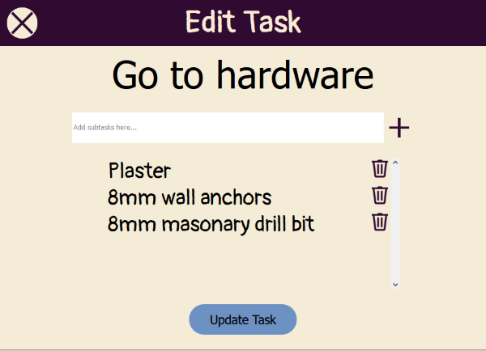

# To Do List

## About the Project

This was my second independent project after having started undertaking a course in Full Stack Development. I was beginning to learn React and decided to create something of my own using this framework. I thought a to-do list would be a reasonable place for me to start however, I wanted to make one that would allow an extra element of flexibility in terms of personal task management. Here are the points I considered when undertaking this project:

* Each task would allow the addition of subtasks, for breaking down tasks into smaller tasks.
* Tasks would be easily editable.
* Tasks containing subtasks would be displayed with a collapsable dispaly.
* Local storage would be used to remember the tasks in the web browser if the user wishes to do so.
* A simple self-explanatory interface to allow quick task adding via a text box or a button for creating tasks with subtasks.
* Mobile-first and responsive design.

I actually use this myself from time-to-time and the ability to create subtasks is useful. For example, if I need to buy things, I can make a "Go to supermarket" task which contains groceries as subtasks and then a "Go to hardware" task with the hardware items I need as subtasks.

## Features

- **Add Detailed Task Button**: Opens a popup for creating a task that has subtasks. Here the user can name the main tasks and add or delete subtasks.
- **Quick Task Textbox**: For quickly adding a task to the list without subtasks.
- **Task Memory Slider**: Utilises the local storage of the web browser- enabling the browser to remember the users tasks if they leave the page.
- **Task Display**: A simple, scrollable list of user's tasks.
- **Task Expander**: To expand or collapse a task's subtask list. This will be greyed-out and non-interactable if task does not contain subtasks.
- **Edit Task Button**: Opens a popup which allows user to edit name of task, or add/delete subtasks.
- **Delete Task Button**: For deleting a task for the list. A popup is displayed first to confirm whether or not a user wants to delete a task. This is for error prevention.

## User Interface Details

- Simple, scrollable task list, where tasks can be marked off with a click of the mouse or tap on a touch device.
- Hover states on buttons for interactivity and feedback.
- Tasks are completely editable via the edit button.
- Simple slider for enabling task memory feature.
- Options for adding simple tasks quickly or adding more detailed tasks.
- Popups to enable error prevention and accidental deletion of tasks.
- Aria labelling used for acessibility.

## What was Learnt During Production

When I began learning React, I was learning to create components with classes, as opposed to using functions and hooks which I learnt later. This app uses classes but I wish I had created it a bit later after having explored functions and hooks. Adapability was a fucus as I wanted this to be a mobile-first design. I expereinced less difficulty with this than I did with a previous project.

## Potential Future Developments

I think an extra feature that could be added is perhaps a feature for adding notes, which could be opened and viewed via a popup. This could also be a sub-feature of an organisation app.

Another potential future development would be recreating this with React Native for a mobile app.

## Screenshots

## Using this Web App
This app is currently deployed on Netlify via: https://snw-todolist.netlify.app/

## Acknowledgements
  * [Netlify](https://www.netlify.com/)
  * [Google Fonts](https://fonts.google.com/)